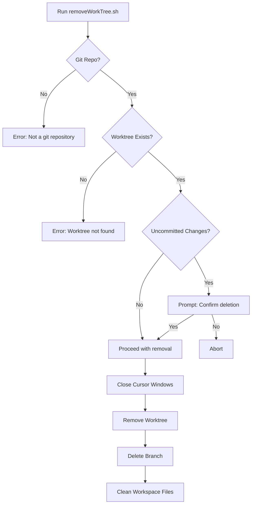

# Helper Scripts Documentation

## Overview

Helper scripts provide automated workflows for Git worktree management and development environment setup. These scripts enhance productivity by automating repetitive tasks and ensuring consistent development practices.

## Scripts

### 1. addWorkTree.sh

**Location**: `helper-scripts/addWorkTree.sh`  
**Purpose**: Creates isolated Git worktrees for parallel feature development with automatic VS Code/Cursor integration

#### Usage

```bash
# Basic usage - creates worktree with default prompt
./helper-scripts/addWorkTree.sh <task_name>

# With custom Claude Code prompt
./helper-scripts/addWorkTree.sh <task_name> [optional_prompt_text...]
```

#### Parameters

| Parameter | Required | Description |
|-----------|----------|-------------|
| `task_name` | Yes | Name of the task/feature branch (e.g., `feature-auth`, `fix-bug-123`) |
| `prompt_text` | No | Custom prompt for Claude Code. Defaults to "Working on: [task_name]" |

#### Features

1. **Automatic Worktree Creation**
   - Creates worktree at `~/dev/worktrees/[repo-name]-[task_name]`
   - Creates new Git branch with provided name
   - Maintains isolation from main development

2. **VS Code Workspace Generation**
   - Auto-generates `.code-workspace` file
   - Configures Claude Code auto-start
   - Sets up proper folder structure

3. **Cursor IDE Integration**
   - Automatically opens Cursor with new workspace
   - Starts Claude Code with task context
   - Ready for immediate development

#### Examples

```bash
# Create worktree for authentication feature
./helper-scripts/addWorkTree.sh feature-authentication

# Create worktree with specific Claude prompt
./helper-scripts/addWorkTree.sh api-refactor "Refactoring the API layer for better performance and maintainability"

# Bug fix worktree
./helper-scripts/addWorkTree.sh fix-memory-leak "Investigating and fixing memory leak in production"
```

#### Workflow


#### Generated Workspace Structure

```
~/dev/worktrees/
└── myproject-feature-auth/
    ├── .git/                    # Worktree git directory
    ├── myproject-feature-auth.code-workspace
    └── [project files]
```

#### Workspace Configuration

The script generates a VS Code workspace file with:

```json
{
  "folders": [
    {
      "path": "."
    }
  ],
  "settings": {
    "claude.autostart": true,
    "claude.prompt": "Working on: feature-auth"
  }
}
```

---

### 2. removeWorkTree.sh

**Location**: `helper-scripts/removeWorkTree.sh`  
**Purpose**: Safely removes Git worktrees with comprehensive cleanup and safety checks

#### Usage

```bash
./helper-scripts/removeWorkTree.sh <task_name>
```

#### Parameters

| Parameter | Required | Description |
|-----------|----------|-------------|
| `task_name` | Yes | Name of the worktree/task to remove |

#### Features

1. **Safety Checks**
   - Detects uncommitted changes
   - Prompts for confirmation before deletion
   - Validates worktree existence

2. **Window Management** (macOS)
   - Automatically closes associated Cursor windows
   - Uses AppleScript for window detection
   - Prevents accidental data loss

3. **Complete Cleanup**
   - Removes Git worktree forcefully
   - Deletes associated feature branch
   - Cleans up workspace configuration files

4. **Error Handling**
   - Clear error messages for missing requirements
   - Helpful suggestions for common issues
   - Non-destructive failure modes

#### Examples

```bash
# Remove completed feature worktree
./helper-scripts/removeWorkTree.sh feature-authentication

# Remove bug fix worktree
./helper-scripts/removeWorkTree.sh fix-memory-leak

# Attempt removal with uncommitted changes (will prompt)
./helper-scripts/removeWorkTree.sh work-in-progress
```

#### Safety Workflow



#### Prompts and Messages

##### Uncommitted Changes Warning
```
Warning: You have uncommitted changes in the worktree:
M  src/file1.js
A  src/file2.js

Are you sure you want to remove this worktree? (y/n)
```

##### Success Message
```
Successfully removed worktree: ~/dev/worktrees/myproject-feature-auth
Deleted branch: feature-auth
Cleaned up workspace file: myproject-feature-auth.code-workspace
```

---

## Best Practices

### Worktree Naming Conventions

Use descriptive, hyphenated names:
- **Features**: `feature-[name]` (e.g., `feature-user-auth`)
- **Bug Fixes**: `fix-[issue]` (e.g., `fix-memory-leak`)
- **Refactoring**: `refactor-[area]` (e.g., `refactor-api-layer`)
- **Experiments**: `experiment-[name]` (e.g., `experiment-new-ui`)

### Workflow Integration

#### Complete Feature Development Flow

```bash
# 1. Create worktree for new feature
./helper-scripts/addWorkTree.sh feature-payment-gateway "Implementing Stripe payment gateway"

# 2. Development happens in Cursor with Claude Code
# ... coding, testing, committing ...

# 3. Create pull request
gh pr create --title "feat: Add payment gateway" --body "Implements Stripe integration"

# 4. After PR merge, clean up
./helper-scripts/removeWorkTree.sh feature-payment-gateway
```

#### Parallel Development

```bash
# Work on multiple features simultaneously
./helper-scripts/addWorkTree.sh feature-auth
./helper-scripts/addWorkTree.sh fix-bug-123
./helper-scripts/addWorkTree.sh refactor-database

# Each worktree is isolated with its own:
# - Git branch
# - Working directory
# - VS Code workspace
# - Claude Code context
```

### Environment Variables

The scripts respect these environment variables:

| Variable | Description | Default |
|----------|-------------|---------|
| `HOME` | User home directory | System default |
| `PWD` | Current working directory | Current directory |

### Troubleshooting

#### Common Issues and Solutions

##### Issue: "Not a git repository"
**Solution**: Run the script from within a Git repository
```bash
cd /path/to/your/project
./helper-scripts/addWorkTree.sh feature-name
```

##### Issue: "Worktree already exists"
**Solution**: Choose a different name or remove existing worktree
```bash
# Remove existing
./helper-scripts/removeWorkTree.sh existing-feature

# Or use different name
./helper-scripts/addWorkTree.sh feature-name-v2
```

##### Issue: "Cursor command not found"
**Solution**: Install Cursor IDE and ensure it's in PATH
```bash
# Install Cursor CLI
cursor --install-cli

# Or open manually after worktree creation
open ~/dev/worktrees/project-feature/
```

##### Issue: "Permission denied"
**Solution**: Make scripts executable
```bash
chmod +x helper-scripts/*.sh
```

### Integration with Claude Code

#### Auto-start Configuration

When a worktree is created, Claude Code automatically starts with:
- Task context from the branch name
- Custom prompt if provided
- Project-specific settings

#### Context Preservation

Each worktree maintains:
- Independent Claude Code session
- Separate conversation history
- Task-specific context
- Isolated tool usage logs

### Advanced Usage

#### Custom Worktree Locations

Modify the script to use custom paths:
```bash
# In addWorkTree.sh, change:
WORKTREE_DIR="$HOME/dev/worktrees"
# To:
WORKTREE_DIR="${WORKTREE_DIR:-$HOME/dev/worktrees}"

# Then use:
WORKTREE_DIR=/custom/path ./helper-scripts/addWorkTree.sh feature
```

#### Batch Operations

Create multiple worktrees:
```bash
# Create worktrees for sprint tasks
for task in auth payment notification; do
  ./helper-scripts/addWorkTree.sh "feature-$task"
done
```

Clean up completed worktrees:
```bash
# Remove all completed feature worktrees
for worktree in feature-*; do
  ./helper-scripts/removeWorkTree.sh "$worktree"
done
```

---

## Script Internals

### addWorkTree.sh Implementation Details

```bash
# Key operations:
1. Validate Git repository
2. Extract repository name
3. Create worktree path
4. Execute git worktree add
5. Generate VS Code workspace JSON
6. Launch Cursor with workspace
```

### removeWorkTree.sh Implementation Details

```bash
# Key operations:
1. Validate Git repository
2. Check worktree existence
3. Detect uncommitted changes
4. Close Cursor windows (macOS)
5. Force remove worktree
6. Delete associated branch
7. Clean workspace files
```

### Error Codes

| Code | Description |
|------|-------------|
| 0 | Success |
| 1 | Not a Git repository |
| 2 | Missing required parameter |
| 3 | Worktree already exists |
| 4 | Worktree not found |
| 5 | User cancelled operation |

---

## Security Considerations

1. **File System Access**: Scripts have full access to create/delete directories
2. **Git Operations**: Can create/delete branches and worktrees
3. **Process Management**: Can close application windows (macOS)
4. **No Network Access**: Scripts operate entirely locally
5. **User Confirmation**: Destructive operations require confirmation

---

## Platform Support

| Platform | addWorkTree.sh | removeWorkTree.sh |
|----------|---------------|-------------------|
| macOS | ✅ Full support | ✅ Full support |
| Linux | ✅ Full support | ⚠️ No window closing |
| Windows | ❌ Bash required | ❌ Bash required |
| WSL | ✅ Full support | ⚠️ No window closing |

---

## Future Enhancements

Potential improvements for these scripts:

1. **Configuration File Support**
   - User preferences for paths
   - Default prompts
   - Custom naming schemes

2. **Integration with Other IDEs**
   - VS Code support
   - JetBrains IDEs
   - Neovim/Vim

3. **Enhanced Safety**
   - Automatic stash creation
   - Backup before deletion
   - Recovery options

4. **Workflow Automation**
   - PR creation integration
   - Test running before removal
   - Merge conflict detection

5. **Multi-Repository Support**
   - Cross-repository worktrees
   - Monorepo awareness
   - Submodule handling