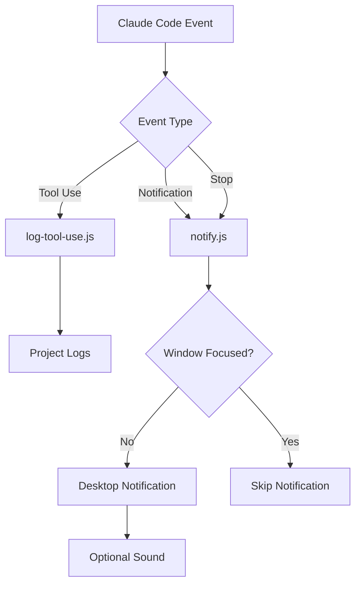

# Claude Code Hooks Documentation

## Overview

Hooks extend Claude Code functionality by responding to specific events during execution. This repository includes two Node.js hooks that provide intelligent notifications and comprehensive logging for macOS environments.

## Hook System Architecture



## Hooks

### 1. Notification Hook (`notify.js`)

**File**: `hooks/notify.js`  
**Events**: `Notification`, `Stop`  
**Purpose**: Intelligent macOS desktop notifications with focus detection and sound support

#### Features

1. **Smart Focus Detection**
   - Uses AppleScript to detect active window
   - Prevents notification spam when you're watching
   - Respects user attention

2. **Sound Customization**
   - Different sounds for different events
   - Configurable via `customConfig.json`
   - System sound integration

3. **Cursor Integration**
   - Click notifications to open project
   - Deep-link to specific directories
   - Automatic focus switching

4. **Message Processing**
   - Markdown stripping for clean notifications
   - Message truncation for long content
   - Project name in title

#### Configuration

**File**: `~/.claude/customConfig.json`

```json
{
  "notificationSoundEnabled": true,
  "notificationSound": "Ping",
  "stopSound": "Glass",
  "forceNotifyIfFocused": false
}
```

#### Configuration Options

| Option | Type | Default | Description |
|--------|------|---------|-------------|
| `notificationSoundEnabled` | boolean | `false` | Enable/disable all notification sounds |
| `notificationSound` | string | `"default"` | Sound for general notifications |
| `stopSound` | string | `"default"` | Sound for task completion |
| `forceNotifyIfFocused` | boolean | `false` | Show notifications even when window is focused |

#### Available Sounds

macOS system sounds:
- **Subtle**: `Purr`, `Pop`, `Tink`
- **Alert**: `Ping`, `Glass`, `Morse`
- **Fun**: `Frog`, `Funk`, `Sosumi`
- **Classic**: `Basso`, `Blow`, `Bottle`
- **Modern**: `Hero`, `Submarine`

#### Testing

```bash
# Test notification with default settings
echo '{"hook_event_name": "Notification", "message": "Test message"}' | node ~/.claude/hooks/notify.js

# Test completion sound
echo '{"hook_event_name": "Stop"}' | node ~/.claude/hooks/notify.js

# Test with forced notification
echo '{"hook_event_name": "Notification", "message": "Important!", "forceNotifyIfFocused": true}' | node ~/.claude/hooks/notify.js

# Test with long message (will be truncated)
echo '{"hook_event_name": "Notification", "message": "'$(printf 'A%.0s' {1..500})'"}' | node ~/.claude/hooks/notify.js
```

#### Input Schema

```typescript
interface NotificationInput {
  hook_event_name: "Notification" | "Stop";
  message?: string;
  forceNotifyIfFocused?: boolean;
}
```

#### Dependencies

1. **terminal-notifier** (required)
   ```bash
   brew install terminal-notifier
   ```

2. **macOS Permissions**
   - System Settings → Privacy & Security → Notifications
   - Enable for `terminal-notifier`

3. **AppleScript** (built-in)
   - Used for window focus detection

#### Setup Instructions

```bash
# 1. Install terminal-notifier
brew install terminal-notifier

# 2. Test installation
terminal-notifier -title "Test" -message "Hello" -sound Ping

# 3. Grant permissions if prompted
# System Settings > Privacy & Security > Notifications

# 4. Enable sounds (optional)
node -e "const fs=require('fs'); const path=require('path'); const configPath=path.join(process.env.HOME, '.claude', 'customConfig.json'); let config={}; try { if(fs.existsSync(configPath)) { config=JSON.parse(fs.readFileSync(configPath, 'utf8')); } } catch(e) {} config.notificationSoundEnabled=true; fs.writeFileSync(configPath, JSON.stringify(config, null, 2));"

# 5. Test the hook
echo '{"hook_event_name": "Notification", "message": "Setup complete!"}' | node ~/.claude/hooks/notify.js
```

---

### 2. Logging Hook (`log-tool-use.js`)

**File**: `hooks/log-tool-use.js`  
**Event**: Tool usage events  
**Purpose**: Comprehensive logging of all tool interactions for debugging and analysis

#### Features

1. **Project-Based Organization**
   - Separate log files per project
   - Automatic project detection
   - Clean log separation

2. **Structured Logging**
   - JSON format for easy parsing
   - Timestamps for all events
   - Complete input/output capture

3. **Automatic Management**
   - Directory creation if needed
   - Append-only for safety
   - No log rotation (manual management)

4. **Error Resilience**
   - Handles JSON parsing errors
   - Continues on write failures
   - Non-blocking operation

#### Log Location

```
~/.claude/logs/
├── project1.log
├── project2.log
└── my-feature.log
```

#### Log Format

```json
{
  "timestamp": "2025-01-08T10:30:00.000Z",
  "project": "my-project",
  "tool": "Read",
  "input": {
    "file_path": "/src/index.js",
    "limit": 100
  },
  "output": "// File contents...",
  "event": "tool_execution"
}
```

#### Input Schema

```typescript
interface ToolUseInput {
  tool_name: string;
  tool_input: any;
  tool_output?: any;
  event: string;
}
```

#### Testing

```bash
# Test with Read tool simulation
echo '{"tool_name": "Read", "tool_input": {"file_path": "/test.js"}, "tool_output": "console.log(\"test\");", "event": "test"}' | node ~/.claude/hooks/log-tool-use.js

# Test with complex input
echo '{"tool_name": "Edit", "tool_input": {"file_path": "/src/app.js", "old_string": "foo", "new_string": "bar"}, "tool_output": {"success": true}, "event": "edit"}' | node ~/.claude/hooks/log-tool-use.js

# Verify log was created
tail -n 5 ~/.claude/logs/$(basename $PWD).log
```

#### Log Analysis

```bash
# View recent tool usage
tail -f ~/.claude/logs/my-project.log | jq '.'

# Count tool usage by type
cat ~/.claude/logs/my-project.log | jq -r '.tool' | sort | uniq -c | sort -rn

# Find all file reads
cat ~/.claude/logs/my-project.log | jq 'select(.tool == "Read") | .input.file_path'

# Get tools used in last hour
cat ~/.claude/logs/my-project.log | jq 'select(.timestamp > (now - 3600 | todate))'
```

---

## Configuration Management

### Enable/Disable Sounds

#### Enable All Sounds
```bash
node -e "const fs=require('fs'); const path=require('path'); const configPath=path.join(process.env.HOME, '.claude', 'customConfig.json'); let config={}; try { if(fs.existsSync(configPath)) { config=JSON.parse(fs.readFileSync(configPath, 'utf8')); } } catch(e) {} config.notificationSoundEnabled=true; fs.writeFileSync(configPath, JSON.stringify(config, null, 2));"
```

#### Disable All Sounds
```bash
node -e "const fs=require('fs'); const path=require('path'); const configPath=path.join(process.env.HOME, '.claude', 'customConfig.json'); let config={}; try { if(fs.existsSync(configPath)) { config=JSON.parse(fs.readFileSync(configPath, 'utf8')); } } catch(e) {} config.notificationSoundEnabled=false; fs.writeFileSync(configPath, JSON.stringify(config, null, 2));"
```

#### Set Custom Sounds
```bash
# Set notification sound to Hero
node -e "const fs=require('fs'); const path=require('path'); const configPath=path.join(process.env.HOME, '.claude', 'customConfig.json'); let config={}; try { if(fs.existsSync(configPath)) { config=JSON.parse(fs.readFileSync(configPath, 'utf8')); } } catch(e) {} config.notificationSound='Hero'; fs.writeFileSync(configPath, JSON.stringify(config, null, 2));"

# Set completion sound to Submarine
node -e "const fs=require('fs'); const path=require('path'); const configPath=path.join(process.env.HOME, '.claude', 'customConfig.json'); let config={}; try { if(fs.existsSync(configPath)) { config=JSON.parse(fs.readFileSync(configPath, 'utf8')); } } catch(e) {} config.stopSound='Submarine'; fs.writeFileSync(configPath, JSON.stringify(config, null, 2));"
```

#### Check Current Configuration
```bash
cat ~/.claude/customConfig.json | jq '.'
```

### Hook Registration

Hooks are registered in `settings.json`:

```json
{
  "hooks": {
    "PostToolUse": [
      {
        "matcher": "*",
        "hooks": [
          {
            "type": "command",
            "command": "node /Users/ryanmcafee/Projects/.claude/hooks/log-tool-use.js"
          }
        ]
      }
    ],
    "Notification": [
      {
        "matcher": "*",
        "hooks": [
          {
            "type": "command",
            "command": "node /Users/ryanmcafee/Projects/.claude/hooks/notify.js"
          }
        ]
      }
    ],
    "Stop": [
      {
        "matcher": "*",
        "hooks": [
          {
            "type": "command",
            "command": "node /Users/ryanmcafee/Projects/.claude/hooks/notify.js"
          }
        ]
      }
    ]
  }
}
```

---

## Use Cases

### Development Workflow Integration

#### Long-Running Tasks
```bash
# Start a complex refactoring
/refactor "entire authentication system"
# Get notification when complete with Glass sound
# Click notification to return to Cursor
```

#### Background Processing
```bash
# Run tests while working on something else
/test-gen "UserService"
# Continue other work
# Get notified when tests are generated
```

#### Multiple Projects
```bash
# Work on project A
cd ~/projects/project-a
/start "implement feature X"

# Switch to project B
cd ~/projects/project-b
/fix-bug "memory leak"

# Notifications tell you which project completed
# Logs kept separate per project
```

### Debugging with Logs

#### Track Tool Performance
```bash
# Analyze which tools are used most
cat ~/.claude/logs/*.log | jq -r '.tool' | sort | uniq -c | sort -rn

# Find slow operations
cat ~/.claude/logs/*.log | jq 'select(.output | length > 10000) | {tool, timestamp}'
```

#### Audit File Access
```bash
# See all files read today
cat ~/.claude/logs/*.log | \
  jq 'select(.tool == "Read" and .timestamp > (now - 86400 | todate)) | .input.file_path' | \
  sort -u
```

#### Error Investigation
```bash
# Find failed operations
cat ~/.claude/logs/*.log | \
  jq 'select(.output == null or .output == "") | {tool, input, timestamp}'
```

---

## Advanced Configuration

### Custom Hook Development

#### Template for New Hook

```javascript
#!/usr/bin/env node

const fs = require('fs');
const path = require('path');

// Read input from stdin
let inputData = '';
process.stdin.on('data', chunk => {
  inputData += chunk;
});

process.stdin.on('end', () => {
  try {
    const input = JSON.parse(inputData);
    
    // Your hook logic here
    processHook(input);
  } catch (error) {
    console.error('Hook error:', error);
    process.exit(1);
  }
});

function processHook(input) {
  // Hook implementation
  console.log('Processing:', input);
  
  // Always exit cleanly
  process.exit(0);
}
```

#### Register Custom Hook

Add to `settings.json`:

```json
{
  "hooks": {
    "YourEvent": [
      {
        "matcher": "*",
        "hooks": [
          {
            "type": "command",
            "command": "node ~/.claude/hooks/your-hook.js"
          }
        ]
      }
    ]
  }
}
```

### Performance Optimization

#### Notification Throttling

Modify `notify.js` to add throttling:

```javascript
// Add at top of file
const THROTTLE_MS = 5000; // 5 seconds
const lastNotification = {};

// In main logic
const now = Date.now();
if (lastNotification[projectName] && 
    now - lastNotification[projectName] < THROTTLE_MS) {
  process.exit(0); // Skip notification
}
lastNotification[projectName] = now;
```

#### Log Rotation

Add log rotation to `log-tool-use.js`:

```javascript
// Check file size before writing
const stats = fs.statSync(logFile);
if (stats.size > 10 * 1024 * 1024) { // 10MB
  // Rotate log
  fs.renameSync(logFile, `${logFile}.${Date.now()}`);
}
```

---

## Troubleshooting

### Common Issues

#### Notifications Not Appearing

1. **Check terminal-notifier**
   ```bash
   which terminal-notifier
   # Should show: /opt/homebrew/bin/terminal-notifier
   ```

2. **Test directly**
   ```bash
   terminal-notifier -title "Test" -message "Test message"
   ```

3. **Check permissions**
   - System Settings → Privacy & Security → Notifications
   - Find `terminal-notifier`
   - Ensure "Allow Notifications" is enabled

#### Sounds Not Playing

1. **Check configuration**
   ```bash
   cat ~/.claude/customConfig.json | jq '.notificationSoundEnabled'
   # Should be: true
   ```

2. **Test sound directly**
   ```bash
   terminal-notifier -sound Ping -title "Test" -message "Sound test"
   ```

3. **Check system volume**
   - Ensure macOS volume is not muted
   - Check notification sound settings

#### Logs Not Created

1. **Check directory exists**
   ```bash
   ls -la ~/.claude/logs/
   ```

2. **Check permissions**
   ```bash
   touch ~/.claude/logs/test.log
   ```

3. **Test hook directly**
   ```bash
   echo '{"tool_name": "test", "tool_input": {}, "event": "test"}' | \
     node ~/.claude/hooks/log-tool-use.js
   ```

#### Focus Detection Not Working

1. **Test AppleScript**
   ```bash
   osascript -e 'tell application "System Events" to get name of first application process whose frontmost is true'
   ```

2. **Check Cursor path**
   ```bash
   ls -la /Applications/Cursor.app
   ```

---

## Security Considerations

1. **File System Access**
   - Hooks can read/write to user directories
   - Log files may contain sensitive information

2. **Process Execution**
   - Hooks run with user permissions
   - Can execute system commands

3. **Network Access**
   - Current hooks don't make network requests
   - Custom hooks should validate external data

4. **Input Validation**
   - Hooks should validate JSON input
   - Handle malformed data gracefully

5. **Log Security**
   - Logs may contain file contents
   - Consider encryption for sensitive projects

---

## Platform Support

| Feature | macOS | Linux | Windows | WSL |
|---------|-------|-------|---------|-----|
| Notifications | ✅ Full | ⚠️ notify-send | ❌ | ⚠️ notify-send |
| Sounds | ✅ Full | ⚠️ paplay | ❌ | ❌ |
| Focus Detection | ✅ Full | ⚠️ xdotool | ❌ | ❌ |
| Logging | ✅ Full | ✅ Full | ⚠️ Path issues | ✅ Full |
| Cursor Integration | ✅ Full | ✅ Full | ✅ Full | ⚠️ Path mapping |

---

## Future Enhancements

### Planned Features

1. **Rich Notifications**
   - Images and icons
   - Action buttons
   - Progress indicators

2. **Advanced Logging**
   - Log rotation
   - Compression
   - Cloud backup

3. **Cross-Platform Support**
   - Linux notification daemon
   - Windows toast notifications
   - WSL integration

4. **Analytics Dashboard**
   - Tool usage statistics
   - Performance metrics
   - Error tracking

5. **Smart Filtering**
   - Notification priorities
   - Do not disturb modes
   - Custom rules engine